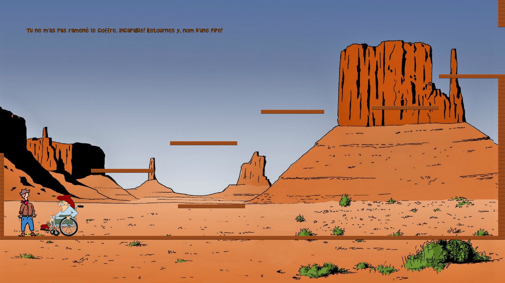

# Billy Bob Game

Made for highschool project (2016)

## Requirements
 + python 3.x.x (tested with python 3.11.7)
 + pygame 2.5.x (tested with pygame 2.5.2)

## How to execute
#### Get the code
`git clone git@github.com:vicLeva/billy_bob_game.git`

#### Run the code (from `billy_bob_game/src/`)
`python main_billy_bob_game.py`

## Preview

## Acknowledgement
Maxime cleret for the dialogue
Pauline Mariette & Simon Lecordier for visuals + code
